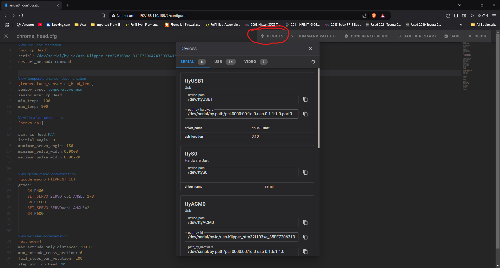
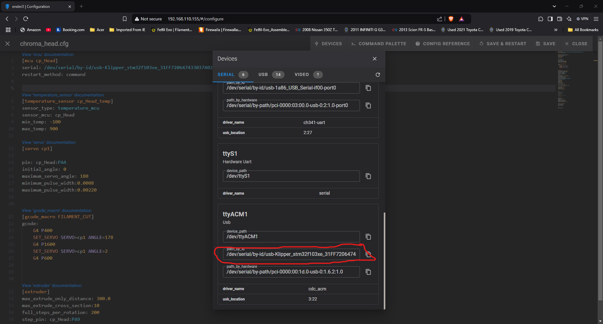
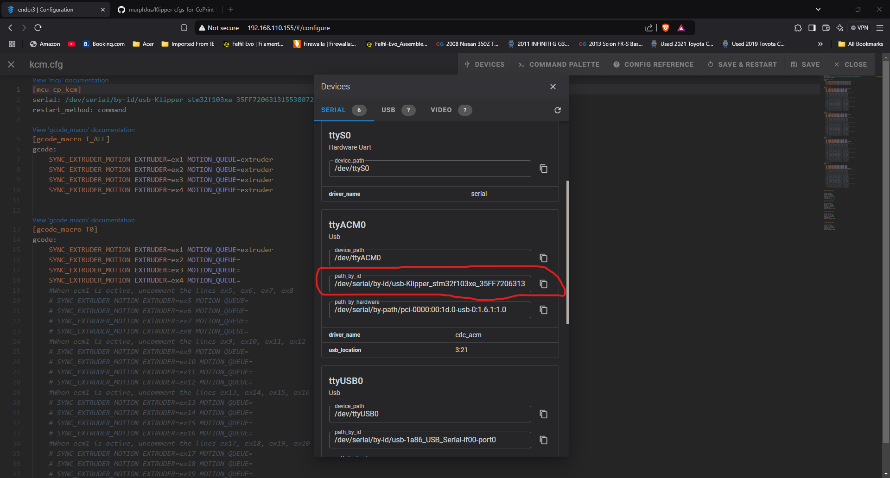

# Klipper-cfgs-for-CoPrint-KCM-Ender3V3-SE-KE

## Z-Offset and Bed Mesh
Bedmesh follows the same normal process, but z-offset must be manually inputted in chroma_head.cfg.

These parameters in bed_mesh.cfg work for now.
```
[bed_mesh]
mesh_min: 43, 10
mesh_max: 205, 215
#There parameters may be adjusted in the future
```

Z-Offset
```
[probe]
pin: cp_Head:PA3

x_offset: 33
y_offset: -1.5

#Input your z-offset here
z_offset: 3.2
```
Save config and restart.

## PID Tune 
PID tuning for the CoPrint Chromahead is inputted manually 
Bed PID is auto stored into the printer.cfg

Start by inputting this into the console 
```
PID_CALIBRATE HEATER=extruder TARGET=220 
```

After it finishes click the save and restart firmware button and record your values.
Input your values into the chroma_head.cfg extruder
```
[extruder]
max_extrude_only_distance: 300.0
max_extrude_cross_section:10
full_steps_per_rotation: 200
step_pin: cp_Head:PA9
dir_pin: !cp_Head:PA8
enable_pin: !cp_Head:PA10
#stepx
microsteps: 16
rotation_distance:  4.55287810496
nozzle_diameter: 0.400
filament_diameter: 1.750
heater_pin: cp_Head:PA2
sensor_type: NTC 100K MGB18-104F39050L32
sensor_pin: cp_Head:PA1
control: pid

#Enter values here
pid_Kp:15.407
pid_Ki:0.744
pid_Kd:79.727
```
Save config and restart.

## MCU USB Identification
Go to the chroma_head.cfg file and click on devices in the top right.


Look For:

And input this into here:
```
[mcu cp_Head]
serial: /dev/serial/by-id/usb-Klipper_stm32f103xe_31FF72064743303740281657-if00
restart_method: command
```

Go to kcm.cfg and click on the device tab again.

Look for:

And input that into here:
```
[mcu cp_kcm]
serial: /dev/serial/by-id/usb-Klipper_stm32f103xe_35FF72063131553807290543-if00
restart_method: command
```
Save config and restart.

## Future Macro adjustments
When you cancel a print, it does not cut and retract the previous color. 
This is what innitiates that process when a print finishes.
```
FILAMENT_CUT
    G1 E-78
    G90
    G1 X{x_stop} Y{y_stop}
    M106 S0
    M104 S0
    M140 S0
```
I will experiment with adding that to this: 
```
[gcode_macro CANCEL_PRINT]
description: Cancel the actual running print
rename_existing: CANCEL_PRINT_BASE
variable_park: True
gcode:
  ## Move head and retract only if not already in the pause state and park set to true

  
    _TOOLHEAD_PARK_PAUSE_CANCEL
  


  TURN_OFF_HEATERS
  CANCEL_PRINT_BASE
``` 
In the near future.
